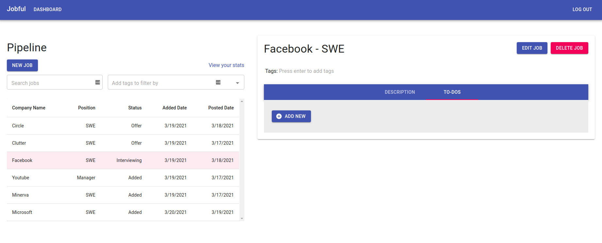
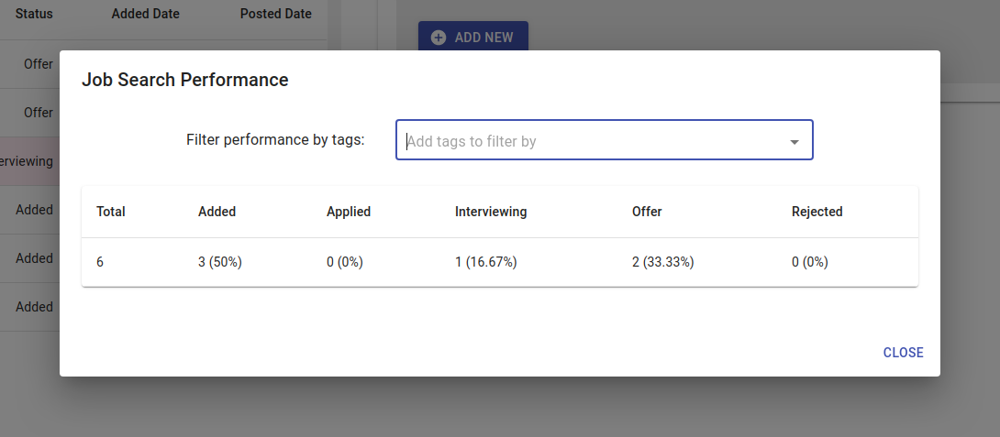
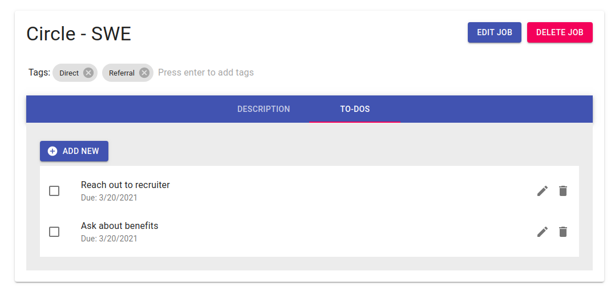
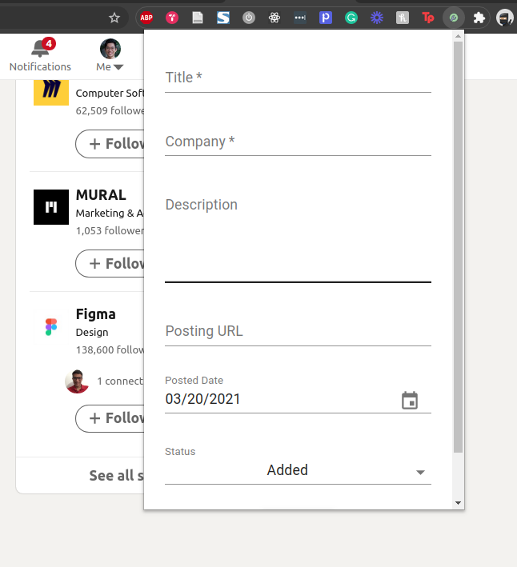
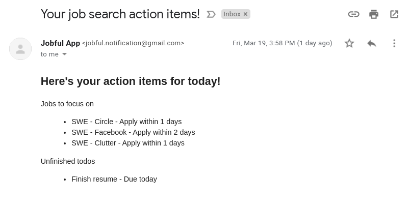

# Jobful - Job search management platform.

This repo contains 3 main folders for 3 respective sub-projects:
- `/backend`: Contains all things API-related.
- `/frontend`: Contains the React.js code for the front-end.
- `/jobful-extension`: Contains code for the companion Chrome extension.

For instructions on how to install the projects, view the folders' `README.md` files.

## Screenshots

1. Dashboard

2. Performance tool

3. Adding custom tags, adding action items, other job-related actions

4. Chrome extension

5. Daily email

### Demo video showing main changes

- https://www.loom.com/share/475a344eefdc41baaaf6fe66ec5b65d4
